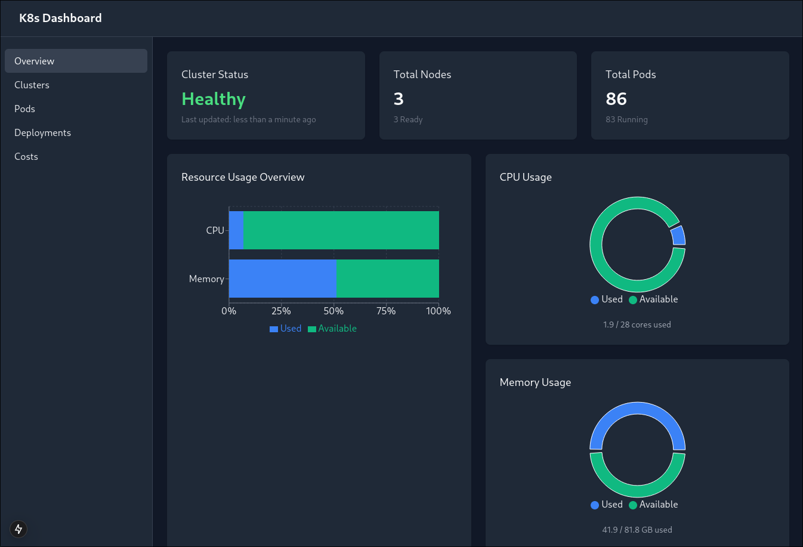
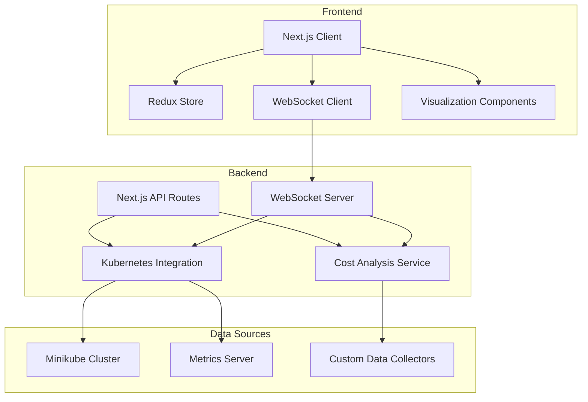

# Cloud Infrastructure Dashboard

A real-time monitoring dashboard for Kubernetes clusters. Built with React, TypeScript, and WebSocket integration for live updates. Features cost optimization insights and deployment tracking.



## Overview

This dashboard provides a comprehensive view of Kubernetes resources with real-time updates and management capabilities. It was built to monitor and manage a self-hosted Kubernetes cluster with an emphasis on performance, usability, and security.

## Features

### Real-time Resource Monitoring

- **WebSocket Integration**: Live updates of cluster metrics without page refreshes
- **Resource Utilization Tracking**: CPU, memory, and storage usage visualization
- **Pod Health Status**: Real-time monitoring of pod states with visual indicators
- **Auto-refreshing Data**: Configurable polling intervals for resource updates

### Interactive Deployment Management

- **Deployment Visualization**: Interactive view of deployments and their relationships
- **Scale Controls**: Easily scale deployments up or down
- **Rollback Capability**: Quick rollback to previous deployment versions
- **Deployment History**: Track changes and update history

### Custom Visualizations

- **Resource Usage Graphs**: Custom-designed charts for resource utilization
- **Cluster Topology View**: Visual representation of cluster architecture
- **Container Health Metrics**: Custom indicators for container status
- **Dark Mode Interface**: Carefully crafted dark theme for reduced eye strain
<!-- 
### Role-Based Access Control UI

- **User Management**: Interface for managing user access
- **Permission Configuration**: Visual permission management
- **Role Assignment**: Assign cluster roles to users
- **Audit Logging**: Track user actions within the dashboard -->

## Technology Stack

- **Frontend Framework**: Next.js 15 with App Router
- **Programming Language**: TypeScript for type safety
- **State Management**: Redux with Redux Toolkit
- **Styling**: Tailwind CSS with custom theme
- **Charts & Visualization**: Recharts
- **API Communication**: REST APIs and WebSockets
<!-- - **Authentication**: JWT-based auth flow -->

## Architecture

The application follows a modern React architecture with:

- Strong typing through TypeScript interfaces
- Component-based design with reusable UI elements
- Redux state management with properly typed actions and reducers
- API abstraction layer for Kubernetes interactions
- Real-time data processing through WebSockets
- Responsive design that works on various screen sizes

### Architecture Diagram




## Development

### Prerequisites

- Node.js 18+
- Access to a Kubernetes cluster (minikube for local development)
- Kubernetes API access configured

### Setup

```bash
# Clone the repository
git clone https://github.com/GooeyTuxedo/k8s-dashboard.git

# Install dependencies
cd k8s-dashboard
npm install

# Start the development server
npm run dev
```

### Configuration

The dashboard connects to your Kubernetes cluster through the standard Kubernetes configuration. Make sure your kubeconfig file is properly set up or provide environment variables for connection details.

## Security Considerations

This dashboard implements several security features:

- Role-based access control to limit user actions
<!-- - JWT authentication with proper token handling -->
- Secure API requests with validation
- No exposure of sensitive cluster information
- Sanitized user inputs to prevent injection attacks

## Future Enhancements

- Enhanced alerting system for resource thresholds
- Cost optimization recommendations
- Integration with Prometheus for advanced metrics
- Multi-cluster support
- Custom dashboard creation
