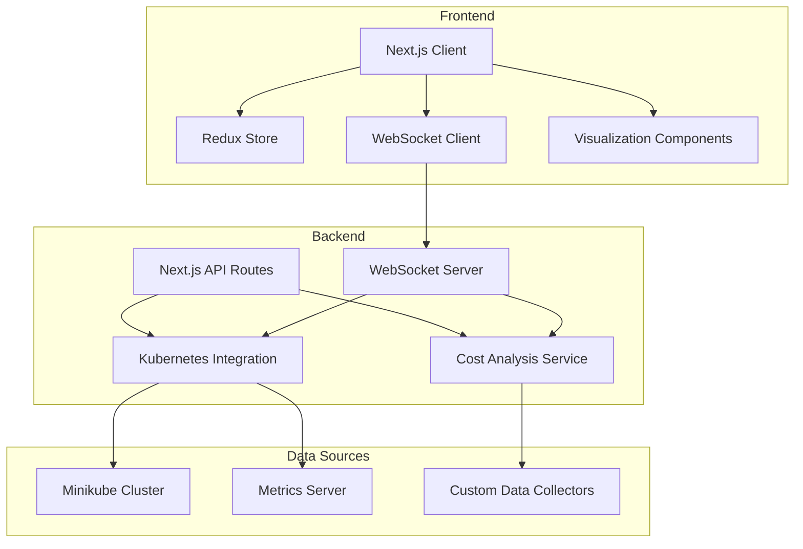

## Cloud Infrastructure Dashboard

A real-time monitoring dashboard for Kubernetes clusters. Built with React, TypeScript, and WebSocket integration for live updates. Features cost optimization insights and deployment tracking.

### Architecture Diagram

